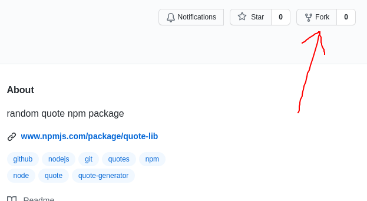
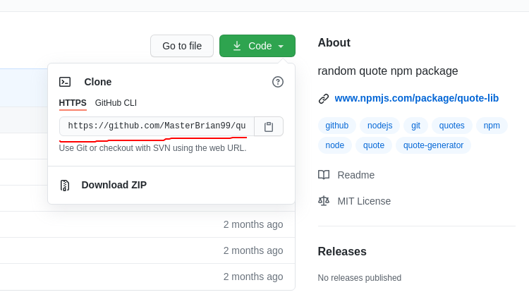
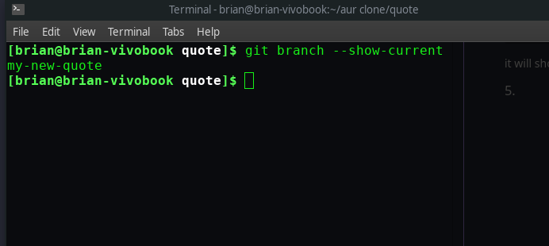

# Contributing to quote-lib
---


## Pull Request Process

1.add new quotes.

2.add new functions to make it more easier. 

3.updating readme guide

---


## if you are new to open source please refer this guide very carefully.otherwise you know what to do 😉

### 1.use git to follow this process.If you don't have git on your machine,install it [https://git-scm.com/](https://git-scm.com/)


### 2.Fork this repository
 

Fork this repository by clicking on the fork button on the top of this page. This will create a copy of this repository in your account.


### 3.Clone the repository 
 

Now clone the forked repository to your machine. Go to your GitHub account, open the forked repository, click on the code button and then click the copy to clipboard icon.

Open a terminal and run the following git command:

```
 $ git clone "url you just copied"
```
> For example: https://github.com/"your-github-name"/quote-lib.git


###  4.Create a branch

go to you cloned folder and create a new branch

```
 $ git checkout -b your-new-branch-name
```

> For example:  git checkout -b my-new-quote

make sure you are in new branch


```
 $ git branch --show-current
```

it will show you something like this


 


#### (remember do not modified the main branch)


### 5.Make necessary changes and commit those changes

```
how to add a new quote.
copy this code and make  necessary changes.then add it to data.json file.

{
    "category":["category1","category2"],
    "quote":"full quote",
    "author":"author name"
}
```


```
 $ git add .
```


add what you did
```
 $ git commit -m "add my new quote"
```

### 6.finally push to github

```
$ git push origin add-your-branch-name
```

#### If you go to your repository on GitHub, you'll see a `Compare & pull request button`. Click on that button.


 


Now submit the pull request.


### i will merge your pull request asap.

